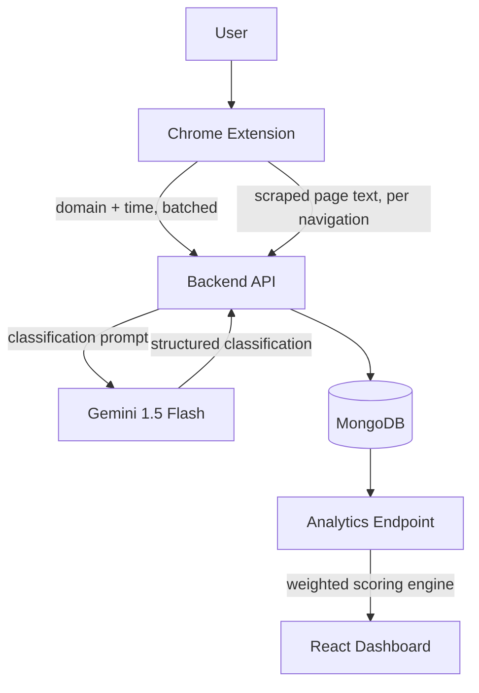

# Zenith

**A browsing-analytics platform that classifies how time is spent online — not just how much — using an LLM-driven scoring pipeline across a browser extension, backend, and dashboard.**

---

## 1. What Zenith Is

Zenith is a system for turning raw browsing activity into a scored productivity and wellbeing profile. A Chrome extension observes time spent per domain and the content of visited pages. A backend service classifies that content using Google's Gemini API and runs the results through a custom weighted-scoring engine. A React dashboard visualizes the resulting scores and time breakdowns.

It's built as three independently maintained repositories — extension, backend, and frontend — connected by a single well-defined API surface.

## 2. Problem → Solution

**Problem.** Most browser time trackers report duration per site using static allow/block lists. That tells you *how long* you were somewhere, but not *what kind of time it was* — ten focused minutes reading documentation and ten distracted minutes scrolling the same site look identical to a duration-only tracker.

**Solution.** Zenith replaces static categorization with content-aware classification. The extension captures both time-on-domain and what the page actually contains. The backend sends that content to an LLM for classification instead of matching it against a fixed keyword table, then feeds the classification into a weighting engine that accounts for time spent, producing normalized scores across several dimensions.

## 3. Architecture



| Layer | Role |
|---|---|
| Chrome Extension | Collects per-domain time and page content directly in the browser |
| Backend API | Ingests activity, orchestrates Gemini classification, computes scores |
| MongoDB | Stores user accounts, time-series domain data, and classified page entries |
| React Dashboard | Visualizes time breakdowns and computed scores |

## 4. How the Three Repositories Work Together

| Repository | Role |
|---|---|
| [zenith-extension](https://github.com/sadique-mohammed/zenith-extension) | Runs in the browser, tracks activity, syncs to the backend |
| [zenith-backend](https://github.com/sadique-mohammed/zenith-backend) | Express/MongoDB API — auth, ingestion, Gemini integration, scoring |
| [zenith-frontend](https://github.com/sadique-mohammed/zenith-frontend) | React dashboard — account creation and analytics visualization |

The extension and frontend never talk to each other directly; both communicate only through the backend's REST API (`/auth`, `/ext`, `/analytics`). An account created on the frontend is linked to the extension by copying an identifier from the web app's post-signup screen into the extension.

### Frontend
Repository: [zenith-frontend](https://github.com/sadique-mohammed/zenith-frontend)

React 18 + Vite application built with Redux Toolkit, Tailwind CSS, and Recharts/Chart.js. Handles a multi-step signup flow, sign-in, and a dashboard that renders time-per-domain, time-per-category, and score data from the backend.

### Backend
Repository: [zenith-backend](https://github.com/sadique-mohammed/zenith-backend)

Node.js/Express API on MongoDB (via Mongoose). Exposes authentication (bcrypt + JWT), extension-data ingestion, and an analytics endpoint that runs the scoring engine. Integrates with Google Gemini for content classification.

### Chrome Extension
Repository: [zenith-extension](https://github.com/sadique-mohammed/zenith-extension)

Manifest V2 extension that tracks active-tab time per domain (with idle detection) and scrapes visited-page text, syncing both to the backend. The account identifier generated at signup links tracked activity to a user.

## 5. AI + Analytics Pipeline

1. **Collection** — the extension supplies per-domain time-on-site and raw page text per visited page.
2. **Classification** — the backend sends each newly seen domain (and each scraped page) to Gemini 1.5 Flash with a structured prompt requesting productivity level, sentiment, category, creativity, and mood, each constrained to a fixed enumerated set of values.
3. **Scoring** — a weighting engine maps each classification to a numeric weight, multiplies by time spent, and normalizes the result to a 0–100 scale across several dimensions (focus, mood, creativity, productivity, sentiment, wellbeing, and an overall total), including day-of-week trend aggregation.
4. **Visualization** — the dashboard fetches computed scores and renders them alongside raw time-per-domain and time-per-category breakdowns.

Classification runs once per newly observed domain or page rather than being recomputed on every sync, avoiding redundant LLM calls for content already seen.

## 6. Key Engineering Features

- **Idle-aware time tracking** at the browser level, distinguishing active engagement from an open-but-unused tab.
- **Structured LLM classification** — a fixed prompt schema constrains Gemini's output to a parseable, enumerated set of values rather than free-form text.
- **Custom weighted-scoring engine** that converts categorical classifications into normalized, comparable scores across multiple dimensions.
- **Split synchronization strategy** — high-frequency domain/time data is batched on an interval, while lower-frequency but heavier page-text data is sent per navigation, matching each data type's cost profile.
- **Independent account system** — bcrypt password hashing and JWT issuance, built without a third-party auth provider.
- **Client-side response caching** on the dashboard to avoid re-fetching scores on every load.

## 7. Technology Stack

| Component | Technologies |
|---|---|
| Frontend | React 18, Vite, Redux Toolkit, Tailwind CSS, Recharts, Chart.js, React Router |
| Backend | Node.js, Express, Mongoose |
| Database | MongoDB |
| Extension | Chrome Extension Manifest V2, Chrome Storage/Idle/Scripting APIs |
| AI | Google Gemini API (`gemini-1.5-flash`) |
| Auth | bcrypt, JSON Web Tokens |
| Deployment | Google App Engine (backend), Firebase Hosting (frontend) |

## 8. Repository Links

| Component | Repository |
|---|---|
| Main Project | [zenith](https://github.com/sadique-mohammed/zenith) |
| Frontend | [zenith-frontend](https://github.com/sadique-mohammed/zenith-frontend) |
| Backend | [zenith-backend](https://github.com/sadique-mohammed/zenith-backend) |
| Chrome Extension | [zenith-extension](https://github.com/sadique-mohammed/zenith-extension) |

`zenith` contains no application code — it documents how the three implementation repositories fit together as a single platform.

```
sadique-mohammed/
├── zenith             ← you are here (documentation/showcase)
├── zenith-frontend    ← React dashboard and web app
├── zenith-backend     ← Express API, database models, AI integration
└── zenith-extension   ← Chrome extension source
```

## 9. Setup

Each repository is set up independently.

**Frontend**
```bash
git clone https://github.com/sadique-mohammed/zenith-frontend.git
cd zenith-frontend
npm install
npm run dev
```

**Backend**
```bash
git clone https://github.com/sadique-mohammed/zenith-backend.git
cd zenith-backend
npm install
npm start
```
Requires environment variables `MONGO_URI`, `SECRET` (JWT signing key), `GEMINI_API_KEY`, and optionally `PORT` (defaults to `5000`).

**Extension**
```bash
git clone https://github.com/sadique-mohammed/zenith-extension.git
```
Load the folder as an unpacked extension via your browser's extensions page in Developer mode, then link it to an account by pasting the identifier shown after signup.

## 10. Known Limitations / Future Improvements

Zenith started as a hackathon build, and a few things are on the roadmap before it's a fully self-serve, multi-user product:

- **Per-user personalization in the dashboard.** The analytics fetch is currently scoped to a fixed identifier for demonstration rather than reading the signed-in user's own account — wiring this through is the next priority.
- **Request-level authorization.** JWTs are issued at login but not yet verified on the ingestion/analytics endpoints; adding that middleware is planned.
- **The Mental Health and Recommendation dashboard views are currently illustrative/placeholder UI**, not yet connected to the Gemini-based pipeline — extending real classification data into those views is a natural next step.
- **Extension provenance.** The core time-tracking mechanics build on patterns from an existing open-source browser time-tracker; the content-scraping, backend sync, and account-linking logic are original additions on top of that base.
- **Environment configuration hardening** — moving all API keys fully into environment-based configuration with no fallback values.
- **Automated account linking**, replacing the current manual copy-paste of the account identifier into the extension.
- **License** — not yet specified for any of the three repositories.
